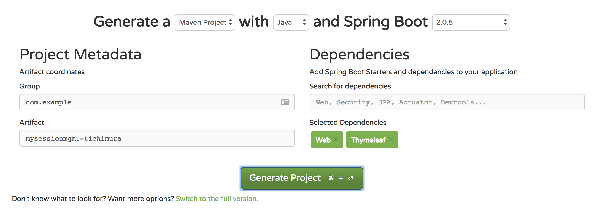

## Springとセッション管理 (Scoped Bean, SessionAttriute)

## 1. 事前設定

- maven
- eclipse/spring tool suite
- redis-cliコマンド
- pcfアカウント
- docker, もしくはpwsアカウント

## 2. プロジェクトの作成

- start.spring.ioから作成

  Web, Thymeleafを選択


## 3. コードの編集

- pom.xmlの確認

``` xml

<dependency>
  <groupId>org.springframework.boot</groupId>
  <artifactId>spring-boot-starter-thymeleaf</artifactId>
</dependency>
<dependency>
  <groupId>org.springframework.boot</groupId>
  <artifactId>spring-boot-starter-web</artifactId>
</dependency>

<dependency>
  <groupId>org.springframework.boot</groupId>
  <artifactId>spring-boot-starter-test</artifactId>
  <scope>test</scope>
</dependency>
</dependencies>


```

## 4. Scoped Proxy Beanの設定 (Configuration)

- Scoped Proxy Beanの設定(Configuration)

session-scoped @Bean that is backed by a proxy

``` java
@Bean
@Scope(value=WebApplicationContext.SCOPE_SESSION, proxyMode=ScopedProxyMode.TARGET_CLASS)
public TodoList todos() {
  return new TodoList();
}
```

- Controllerの設定

session-scoped beanを@Controllerでインジェクト

``` Java
@Controller
@RequestMapping("/scopedproxy")
public class TodoControllerWithScopedProxy {

    private TodoList todos;

    // constructor and request mappings
}
```

**note**
> scoped proxyの場合、Request メソッドになんの変更もいらないところがメリット
> Controllerがsingletonスコープであるべきことは注意
> session scoped beanが、自由にインジェクションされたくない場合は、@SessionAttriutesを使う

## 5. SessionAttriutesの利用

Springが管理するBean(Scoped proxy bean)ではなく、`@ModelAttribute`として定義、 `@SessionAttributes` アノテーションにより、controllerのみのスコープとする

Controllerがアクセスされたら、Springはインスタンス初期化後、Modelにインスタンスを配備する.
`@SessionAttributes`のインスタンスについても同様。

``` java
@ModelAttribute("todos")
public TodoList todos() {
    return new TodoList();
}
```

`@SessionAttributes`として、Controllerクラスを定義

``` java
@Controller
@RequestMapping("/sessionattributes")
@SessionAttributes("todos")
public class TodoControllerWithSessionAttributes {
    // ... other methods
}
```

リクエスト応答にBeanを利用するため、`@RequestMapping`で定義されているメソッドにおいてリファレンスを提供

``` java
@GetMapping("/form")
public String showForm(
  Model model,　@ModelAttribute("todos") TodoList todos) {
    if (!todos.isEmpty()) {
        model.addAttribute("todo", todos.peekLast());
    } else {
        model.addAttribute("todo", new TodoItem());
    }
    return "sessionattributesform";
```

さらに、PostMappingにおいて、`RedirectView`を返す際に、`RedirectAttributes`をインジェクトして、`addFlashAttribute`を呼び出す. これによりModelクラスが実装されることで、URLパラメータのエンコードが可能となる

```
@PostMapping("/form")
public RedirectView create(
  @ModelAttribute TodoItem todo,
  @ModelAttribute("todos") TodoList todos,
  RedirectAttributes attributes) {
    todo.setCreateDate(LocalDateTime.now());
    todos.add(todo);
    attributes.addFlashAttribute("todos", todos);
    return new RedirectView("/sessionattributes/todos.html");
  }
```


## 4. スタンドアロンでの実行


## 5. PCF(PWS)での実行


## 6. アプリの確認


## 7. 参考情報
